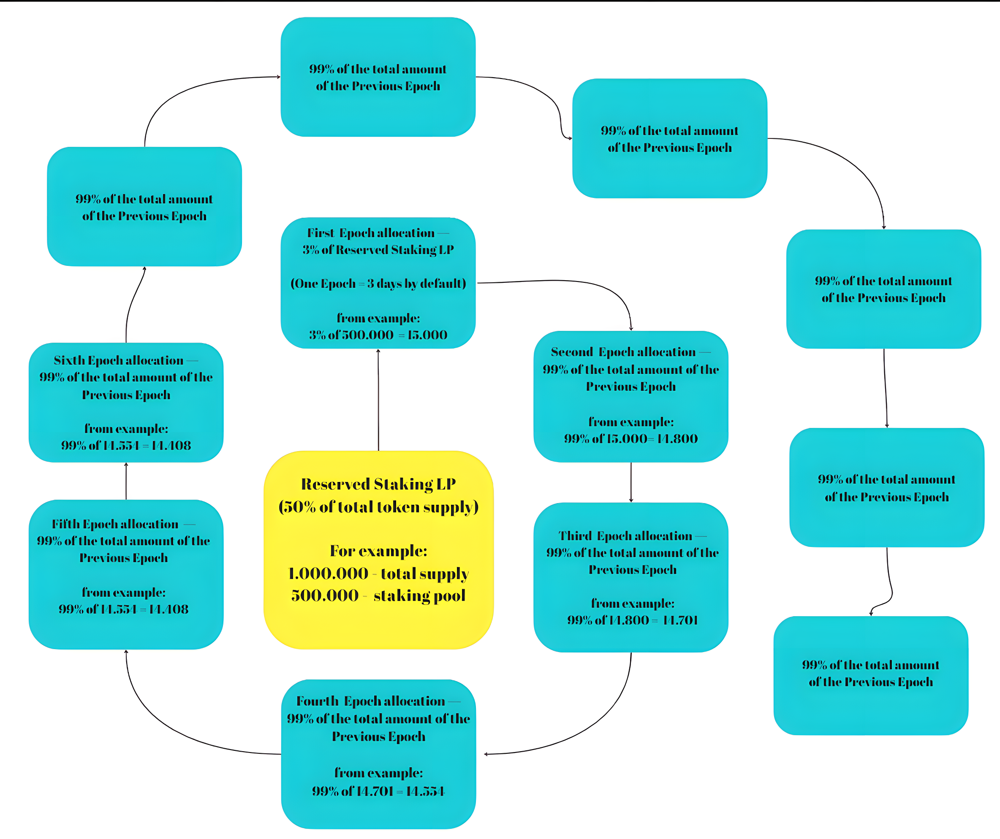

---
layout:
  title:
    visible: true
  description:
    visible: true
  tableOfContents:
    visible: true
  outline:
    visible: true
  pagination:
    visible: true
---

# 🧐 How Staking Platform works?

### Here you will learn about the technical part of the Staking Mechanism:

* #### How token allocation happens?&#x20;
* **Epoch-Based Reward Distribution Mechanism**
* **How it is possible to create the first vAMM NFT x Token system on SPL22?**

### How token allocation happens?

**The Staking Rewards** is a smart contract where a calculated amount of the total token supply is deposited at the initial distribution. The formula for calculating the Staking token quantity is:

$$
\text{Staking Rewards Treasury Tokens Quantity} = \frac{\text{Total Supply} - \text{Tokens Allocated to LP}}{2}
$$

### Epoch-Based Reward Distribution Mechanism

An "epoch" in the context of the Solana blockchain is a term adapted to refer to a pre-defined sequence of blocks that is used as the basis for periods of reward distribution.

#### Example Calculation:

If we set the duration of one epoch to approximately 3 days, considering the Solana network's average block time is 0.4 seconds, the number of blocks in one epoch can be calculated as follows:

$$
\text{Number of blocks per epoch} = \frac{\text{Duration of epoch in seconds}}{\text{Average block time}}
$$

_**Given:**_

$$
\text{Duration of epoch} = 3 \text{ days} \times 24 \text{ hours/day} \times 3600 \text{ seconds/hour}
$$

$$
\text{Average block time} = 0.4 \text{ seconds/block}
$$

_**The formula becomes:**_

$$
\text{Number of blocks per epoch} = \frac{3 \times 24 \times 3600}{0.4}
$$

$$
\text{Number of blocks per epoch} = 648,000
$$

**Thus, an epoch on our platform is defined as a period containing 648,000 blocks.**

### Rewards Allocation Per Epoch (explained)

<figure><figcaption>
Concept of Epoch distribution - explained  
</figcaption></figure>

Remember when you were a child and you used to feed the pigeons in the park 🐦 \
\
If you throw out the whole bag of food at once, the birds will immediately pounce on the food, quickly eat it all and fly away. But if you throw the crumbs in gradually, the birds will come back again and again, and you'll develop a long-lasting friendship with them.

And so it is with Epochal Staking: if you distribute the rewards not all at once, but in small portions at each new 'epoch', the participants will stay active and engaged for a long period of time, providing stability and continued interest in the pool.&#x20;

#### Example:&#x20;

* The staking pool is allocated 500,000 tokens and the first epoch is allocated 2% of the staking pool supply - that's 15,000 tokens (see image above);
* As we assumed above - 1 epoch goes for 3 days - that's 648,000 blocks;&#x20;
* For every 10.000 blocks, \~231.4 tokens are distributed to all holders;
* Everyone who staked their NFT in these blocks - will be farming tokens for the entire epoch;
* The next epoch is allocated 99% of the first epoch (99% of 15.000 = 14.800 tokens), then 99% of the second epoch (99% of 14.800 = 14.701) and so on to infinity;
* This forms a spiral curve that will decrease very smoothly (see image);
* Also, this technology helps protect the pool from whales that could take a large portion of the pool for themselves and create a healthy distribution ecosystem.

### Additional rewards :

**LP providers will stimulate** NFT holders to stake their NFT's by adding **additional rewards** to the reward pool:

* NFT's of other projects;
* Tokens of project;
* SOL/USDC rewards;

**Principle of reward distribution: 1 staked NFT = 1 ticket for win, the more NFT's was staked, the more rewards user will get.**

What do LP providers get in return?

#### LP providers benefits:&#x20;

For contributing rewards to the Reward Pool, providers will receive the following benefits:

* 50% of NFT royalties;
* Access to voting for the future of the pool (increased percentage of awards in the next epoch and so on).

#### How will providers' votes be determined?

1. **Total LP added = 100%**
2. **Provider percent added = how much percent of that provider's vote affects the changes.**

\
