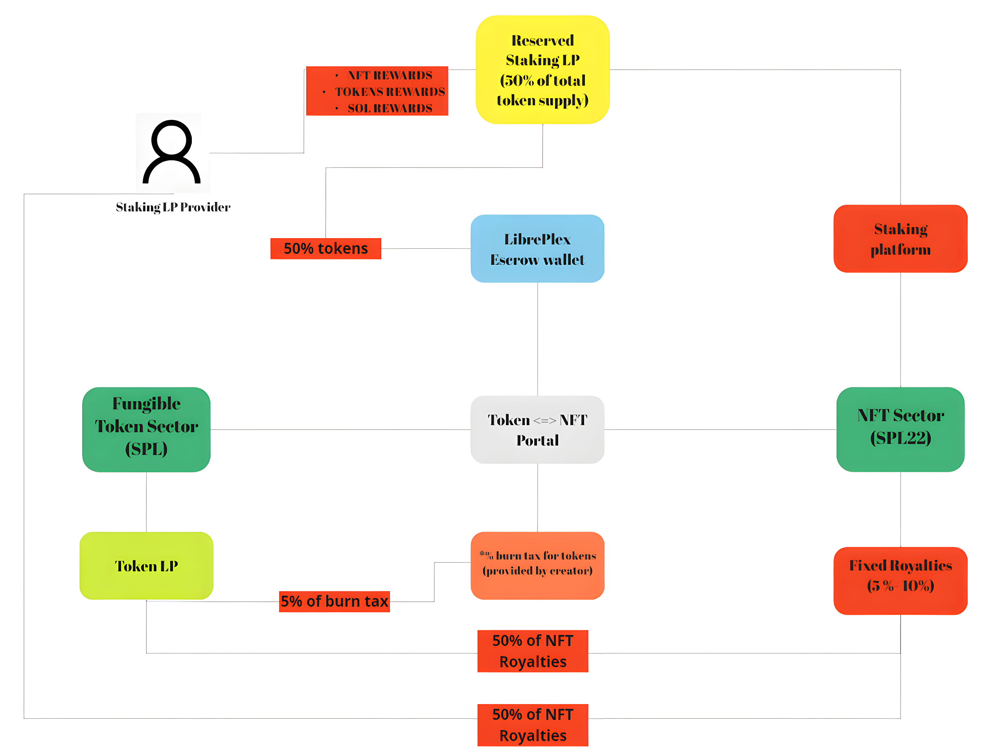

# 🚀 System with an upside only pattern

<figure><figcaption>
New System Structure
</figcaption></figure>

### Upgraded System Conception

The updated system introduces key innovations to reduce volatility and increase liquidity in SPL22 :

### Staking Platform ( <mark style="color:red;">right-hand side</mark> )

* **Staking platform** will allow users to receive additional rewards for staking their NFT from a pre-reserved Staking LP with additional rewards; \
  This will help remove the listing walls, and make it easier to raise the floor price!&#x20;

### Reserved Staking Pool ( <mark style="color:yellow;">yellow-coloring</mark> )

* **Reserved Staking Pool** contains 50% of the total token supply from <mark style="color:blue;">Escrow Wallet</mark> and additional rewards from LP Providers;
* **Pool rewards** are distributed across epochs using a spiral distribution scheme (this concept is implemented in Curve Finance);
* **Only those** who staked their NFTs can receive pool rewards.

(Read more about how this works in 🧐[How Staking Platform works](how-staking-platform-works.md))&#x20;

### Staking LP providers (person on the left)

* **LP Providers** act as liquidity investors and can also participate by adding various additional rewards to the pool such as different NFT'S, project Tokens and even SOL/USDC;&#x20;
* **For all this Providers** will receive 50% of all royalties for trading NFT's and get the right to vote for changes to the pool (increased reward in the next epoch, reduced royalty and so on, literally giving the community control over the project ecosystem);
* **LP Providers** are driving token growth, by adding more liquidity to the token, creating a chain reaction for the NFT sector (token goes up = NFTs floor price goes up).

### Token Portal Swap Dynamics

* **50% of the burn tax** (set by the collection creator) goes to the LP pool, increasing the availability of the token for buyers and supporting its price stability.

### NFT Royalties

*   We propose to add royalty for NFTs (available for creator editing), but with one condition: 100% of royalties go straight to Liquidity Pool.

    \
    We have following situation:

    1. Continuously generated volumes in the NFT market provide more royalties that go to LPs, increasing the price of the token
    2. Due to other sources of income in LP (burn tax fees, LP Providers etc.) the token price grows faster than NFT, creating arbitrage opportunities
    3. This also causes the NFT floor to grow, creating even more volumes - royalties from volumes. It's an endless spiral that going to the moon! 🚀 🌖

    \
    **All of these pieces combine to form a a complete, synergistic system with an upside only pattern to the collection 😉**
